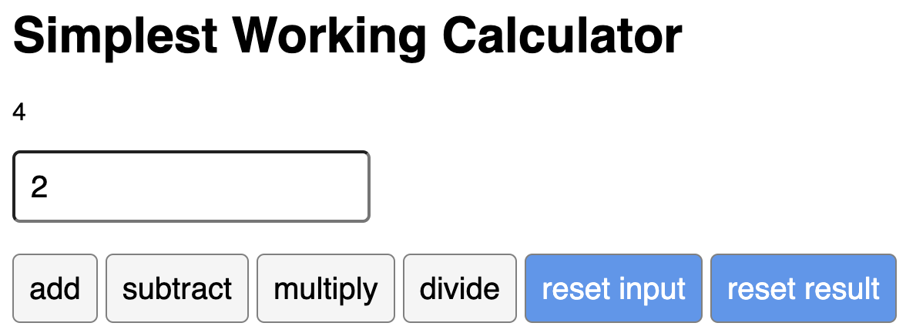

# React Calculator App

### This is a simple working calculator app that was built using React. It can perform the four basic mathematical operations: addition, subtraction, multiplication, and division.

#

### This project was made for the final lab assignment in the [Meta Front-End Developer Professional Certificate](https://www.coursera.org/professional-certificates/meta-front-end-developer) React Basics course.

#

